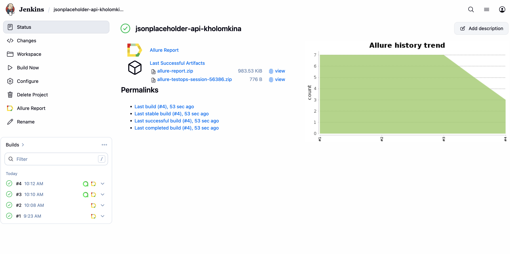
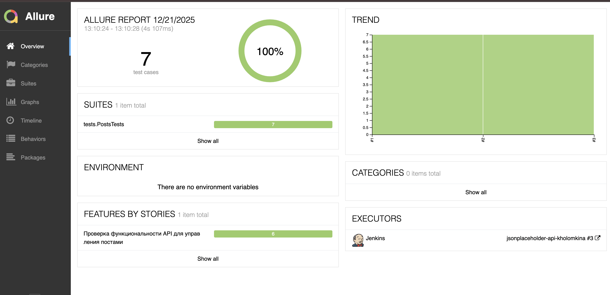
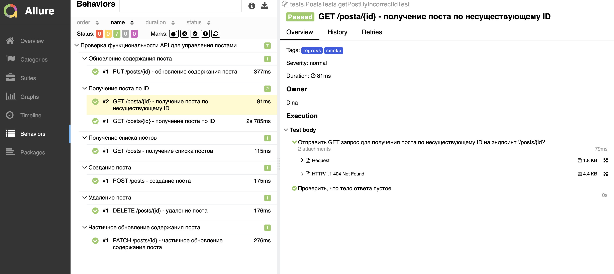
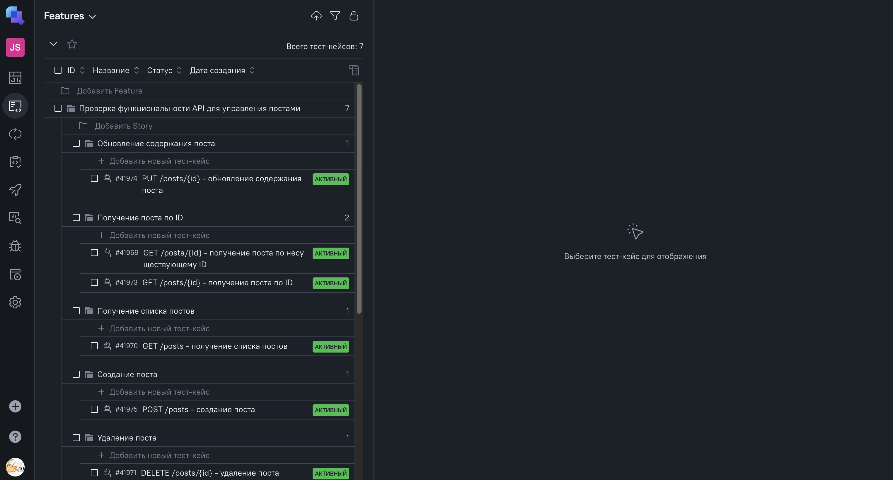
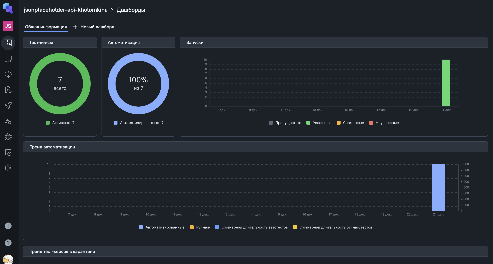
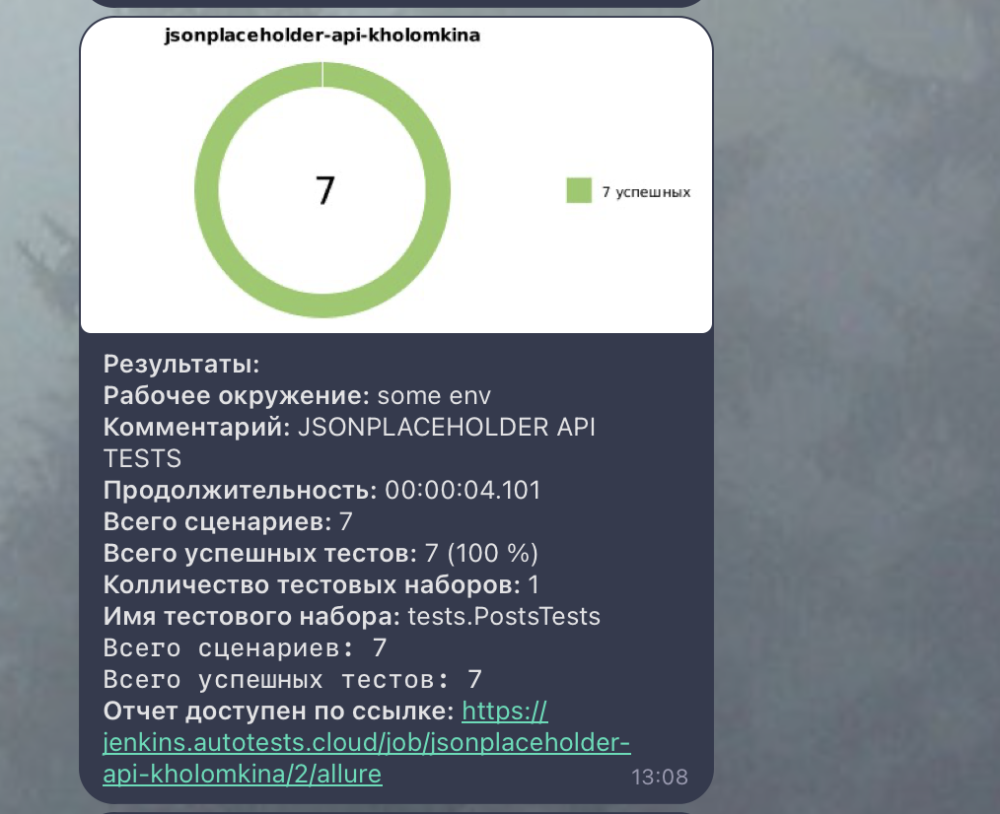

# Проект по автоматизации API для [JsonPlaceholder](https://jsonplaceholder.typicode.com/)


## **Содержание:**

* [Технологии и инструменты](#star-технологии-и-инструменты)

* [Реализованные проверки](#open_file_folder-реализованные-проверки)

* [Запуск из терминала](#computer-запуск-из-терминала)

* [Сборка в Jenkins](#сборка-в-jenkins)

* [Allure отчет](#allure-отчет)

* [Интеграция с Allure TestOps](#интеграция-с-allure-testops)

* [Уведомление в Telegram при помощи бота](#уведомление-в-telegram-при-помощи-бота)

  <br>


---
## :star: Технологии и инструменты:

<p>
<a href="https://www.jetbrains.com/idea/"></a>
<a href="https://www.java.com/ru/"></a>
<a href="https://junit.org/"></a>
<a href="https://ru.selenide.org/"></a>
<a href="https://allurereport.org/"></a>
<a href="https://gradle.org/"></a>
<a href="https://www.jenkins.io/"></a>
<a href="https://qameta.io/"></a>
</p>  
<br>


---
## :open_file_folder: Реализованные проверки:

- API:
  - GET /posts - получение списка постов
  - POST /posts - создание поста
  - GET /posts/{id} - получение поста по ID
  - GET /posta/{id} - получение поста по несуществующему ID
  - PUT /posts/{id} - обновление содержания поста
  - PATCH /posts/{id} - частичное обновление содержания поста
  - DELETE /posts/{id} - удаление поста
  <br>


---
## :computer: Запуск из терминала:

### Локальный запуск

Для локального запуска тестов используйте следующую команду:
```
./gradlew clean test
```

---
##  Сборка в Jenkins:

  
<br>


---
##  Allure отчет:

**[Ссылка на Allure-отчет](https://jenkins.autotests.cloud/job/jsonplaceholder-api-kholomkina/3/allure/)**

**Overview:**


<br><br>

**Tests:**

  
<br>


---
##  Интеграция с Allure TestOps:

**[Ссылка на Allure TestOps](https://allure.autotests.cloud/project/5060/test-cases?treeId=9890)**


**Тест-кейсы:**


<br><br>

**Dashboard прогонов:**

  
<br>


---
##  Уведомление в Telegram при помощи бота:


<br>

